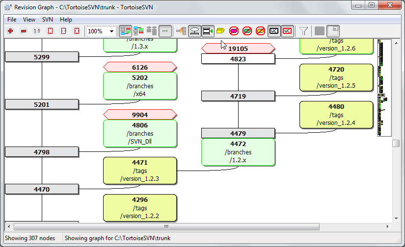
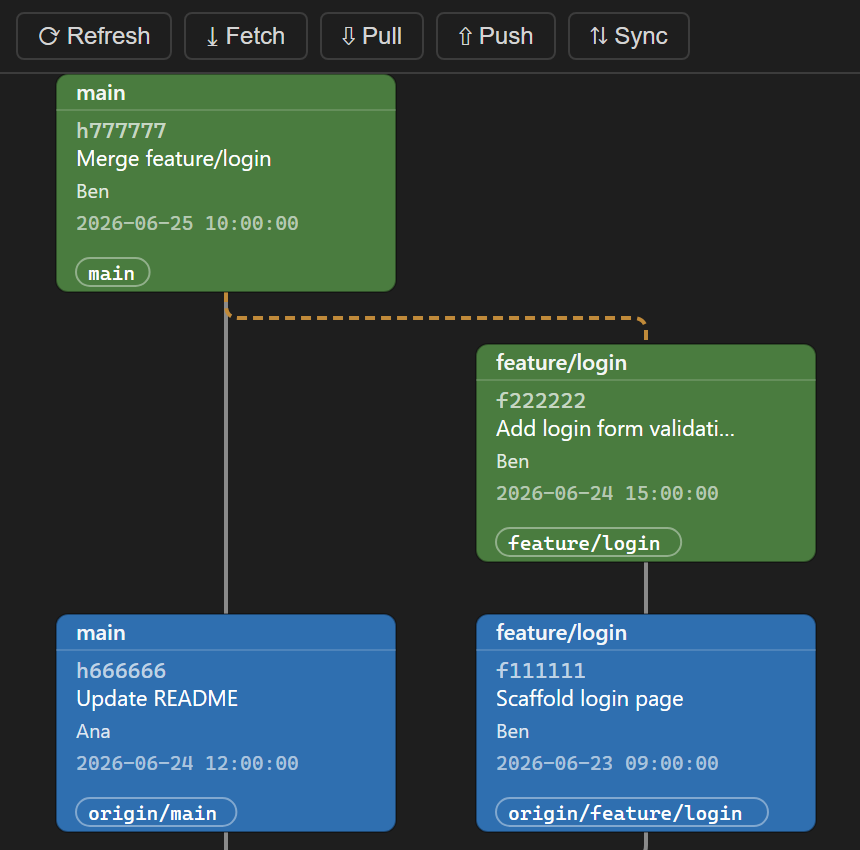

# Git Revision Graph

A **TortoiseSVN-style Revision Graph** for **Git**, for both **Visual Studio
(2022 / 2026)** and **VS Code**. Commits, local & remote branches, and tags are
drawn as connected boxes; right-click a commit to **create a branch from it**
using the host's native Git.

**▶ [Try the live demo](https://hunkontech.github.io/vs_2026_git_Revision_Graph/)** — runs the
real renderer in your browser with a sample repository; every action (create
branch, checkout, copy SHA, stash, zoom & pan) works against mock data.





## What it does
- Renders the git DAG as boxes-and-edges, with a column-per-branch layout.
- Colors nodes by ref type: current/HEAD, local branch, remote branch, tag,
  plain commit — echoing the SVN graph's grey/green/yellow scheme.
- Shows **local and remote** branches and tags.
- **Right-click → "Create branch from here…"** seeds a new branch at the clicked
  commit via the host's native Git, then refreshes.
- Checkout a commit, copy its SHA, zoom & pan.

## How to open the graph

### VS Code
1. Open a folder or workspace that contains a Git repository.
2. Either:
   - Open the **Command Palette** (`Ctrl+Shift+P`) and run **"Git Revision Graph: Open Revision Graph"**, or
   - Click the **graph icon** in the Source Control title bar (top-right of the SCM panel).

### Visual Studio (2022 / 2026)
1. Open a folder or solution that is inside a Git repository.
2. Go to **View → Other Windows → Revision Graph**.

Right-click any commit node to **create a branch from it** or to copy its SHA.

## Architecture (monorepo)
One shared web renderer, embedded by two thin hosts:

```
packages/
  protocol/      host <-> webview message contracts (single source of truth)
  graph-core/    pure DAG lane/row layout algorithm (unit-tested, no DOM)
  graph-webview/ the SVG renderer + context menu (builds to one bundle)
vscode/          VS Code extension (TS): vscode.git data + native createBranch
vs/              Visual Studio VSIX (C#): tool window + WebView2 host
```

The `graph-webview` bundle is the shared artifact: VS Code loads it in a webview,
the C# VSIX loads the same files in WebView2. Branch creation uses the
**native** Git of each host:
- VS Code: `vscode.git` API `Repository.createBranch(name, checkout, ref)`.
- Visual Studio: git CLI behind a themed dialog (native-dialog seeding is a
  documented future enhancement).

## Develop

```bash
npm install
npm test                 # graph-core layout unit tests
npm run build            # build all packages + both host bundles
npm run harness          # browser dev harness with mock data -> http://localhost:5599
```

### VS Code extension
```bash
npm run build
```
Then open the repo in VS Code and press **F5** (Extension Development Host).
Run **"Git Revision Graph: Open Revision Graph"** from the command palette, or
use the source-control title-bar button. Requires a workspace with a Git repo.

### Visual Studio extension
Windows-only (2022 / 2026). See [vs/BUILD.md](vs/BUILD.md) for complete prerequisites and build steps.

Quick start:
```bash
npm install
npm run build:webview
npm run build:vs-assets
```

Then open `vs/RevisionGraph.csproj` in Visual Studio (with the extension development workload installed), restore NuGet packages, and press **F5** to launch an experimental instance. Open a folder or solution inside a Git repo, then go to **View → Other Windows → Revision Graph** to open the tool window. Right-click a commit to create a branch from it using the native Git CLI.

## Building the installers

```bash
# VS Code .vsix only (cross-platform)
npm run package:vscode      # -> dist/installers/rev-graph-vscode-<version>.vsix
```

```powershell
# All three installers — Windows + Visual Studio + Node (run from repo root)
pwsh scripts/build-installers.ps1            # VS 2022 + VS 2026 VSIX + VS Code vsix
pwsh scripts/build-installers.ps1 -VSCodeOnly
pwsh scripts/build-installers.ps1 -SkipVSCode
```

- [scripts/package-vscode.mjs](scripts/package-vscode.mjs) — builds the shared
  bundle and packages the VS Code extension via `@vscode/vsce`.
- [scripts/build-installers.ps1](scripts/build-installers.ps1) — locates VS 2022
  (`[17.0,18.0)`) and VS 2026 (`[18.0,19.0)`, prerelease) with `vswhere`, builds
  the VSIX against each, and also packages the VS Code `.vsix`.

All outputs land in `dist/installers/`.

## Status
- ✅ `graph-core` layout + tests
- ✅ shared SVG renderer + context menu (verified in browser harness)
- ✅ VS Code extension (data layer verified against a real repo end-to-end)
- ✅ Visual Studio VSIX authored (build & run on Windows per `vs/BUILD.md`)

## License

**HunKon Personal Use License v1.0** — free for personal use.
For commercial use, please contact [koncsik.benedek.andras@gmail.com](mailto:koncsik.benedek.andras@gmail.com).

---

# Git Revision Graph (Magyar)

Egy **TortoiseSVN-stílusú revíziógraf** **Git**-hez, mind **Visual Studio (2022 / 2026)**, mind **VS Code** alatt. A commitok, helyi és távoli ágak, valamint tagek összekötött dobozokként jelennek meg; jobb klikkel egy commiton **új ágat hozhatsz létre belőle** a fogadó alkalmazás natív Git-jén keresztül.

**▶ [Próbáld ki az élő demót](https://hunkontech.github.io/vs_2026_git_Revision_Graph/)** — a
valódi megjelenítő fut a böngésződben egy minta-repozitóriummal; minden funkció
(ág létrehozása, checkout, SHA másolás, stash, nagyítás és mozgatás) működik a
mock adatokon.


## Mit csinál
- A git DAG-ot dobozok és élek formájában rajzolja ki, áganként egy oszloppal.
- A csomópontokat ref-típus szerint színezi: aktuális/HEAD, helyi ág, távoli ág, tag, sima commit — az SVN-gráf szürke/zöld/sárga sémájára emlékeztetve.
- Megjeleníti a **helyi és távoli** ágakat és tageket.
- **Jobb klikk → „Ág létrehozása innen…"** — új ágat hoz létre a kiválasztott committól a fogadó alkalmazás natív Git-jén keresztül, majd frissíti a gráfot.
- Commit közvetlen kivétele (checkout), SHA másolása, nagyítás és mozgatás.

## A gráf megnyitása

### VS Code
1. Nyiss meg egy mappát vagy munkaterületet, amely egy Git repozitóriumot tartalmaz.
2. Vagy:
   - Nyisd meg a **Parancspalettát** (`Ctrl+Shift+P`) és futtasd a **"Git Revision Graph: Open Revision Graph"** parancsot, vagy
   - Kattints a **gráf ikonra** a Forráskezelő panel fejlécében (jobb felső sarok).

### Visual Studio (2022 / 2026)
1. Nyiss meg egy mappát vagy megoldást, amely egy Git repozitóriumon belül van.
2. Lépj a **Nézet → Egyéb ablakok → Revision Graph** menüpontba.

Jobb klikkel bármely commit csomóponton **új ágat hozhatsz létre**, vagy másolhatod a SHA-ját.

## Architektúra (monorepo)
Egy közös webes megjelenítő, amelyet két vékony hoszt foglal magában:

```
packages/
  protocol/      hoszt <-> webview üzenetszerződések (egyetlen forrás)
  graph-core/    tiszta DAG sáv/sor elrendező algoritmus (egységtesztelt, DOM nélkül)
  graph-webview/ az SVG megjelenítő + helyi menü (egy bundle-lé épül)
vscode/          VS Code bővítmény (TS): vscode.git adat + natív createBranch
vs/              Visual Studio VSIX (C#): eszközablak + WebView2 hoszt
```

A `graph-webview` bundle a közös termék: a VS Code egy webview-ban tölti be, a C# VSIX ugyanezeket a fájlokat WebView2-ben. Az ág létrehozása az egyes hosztok **natív** Git-jét használja:
- VS Code: `vscode.git` API `Repository.createBranch(name, checkout, ref)`.
- Visual Studio: git CLI egy témázott párbeszédablak mögött.

## Fejlesztés

```bash
npm install
npm test                 # graph-core elrendező egységtesztek
npm run build            # minden csomag + mindkét hoszt bundle buildelése
npm run harness          # böngészős fejlesztői harness mock adatokkal -> http://localhost:5599
```

### VS Code bővítmény
```bash
npm run build
```
Majd nyisd meg a repót VS Code-ban és nyomj **F5**-öt (Extension Development Host).
Futtasd a **"Git Revision Graph: Open Revision Graph"** parancsot a parancspalettáról, vagy használd a forráskezelő fejlécgombot. Git repót tartalmazó munkaterület szükséges.

### Visual Studio bővítmény
Csak Windows (2022 / 2026). Lásd [vs/BUILD.md](vs/BUILD.md) a teljes előfeltételekért és build lépésekért.

Gyors indítás:
```bash
npm install
npm run build:webview
npm run build:vs-assets
```

Majd nyisd meg a `vs/RevisionGraph.csproj`-t Visual Studioban (a bővítményfejlesztési munkaterhelés telepítve legyen), állítsd vissza a NuGet csomagokat, és nyomj **F5**-öt egy kísérleti példány indításához. Nyiss meg egy Git repón belüli mappát vagy megoldást, majd lépj a **Nézet → Egyéb ablakok → Revision Graph** menüpontba.

## Telepítők buildelése

```bash
# Csak VS Code .vsix (cross-platform)
npm run package:vscode      # -> dist/installers/rev-graph-vscode-<verzió>.vsix
```

```powershell
# Mindhárom telepítő — Windows + Visual Studio + Node (a repo gyökeréből futtatva)
pwsh scripts/build-installers.ps1            # VS 2022 + VS 2026 VSIX + VS Code vsix
pwsh scripts/build-installers.ps1 -VSCodeOnly
pwsh scripts/build-installers.ps1 -SkipVSCode
```

Minden kimenet a `dist/installers/` mappába kerül.

## Állapot
- ✅ `graph-core` elrendező + tesztek
- ✅ közös SVG megjelenítő + helyi menü (böngészős harness-ben ellenőrizve)
- ✅ VS Code bővítmény (adatréteg valós repón végigvizsgálva)
- ✅ Visual Studio VSIX elkészítve (build & futtatás Windows alatt a `vs/BUILD.md` szerint)

## Licenc

**HunKon Personal Use License v1.0** — személyes használatra ingyenes.
Üzleti célú felhasználás esetén kérlek vedd fel velem a kapcsolatot: [koncsik.benedek.andras@gmail.com](mailto:koncsik.benedek.andras@gmail.com).
